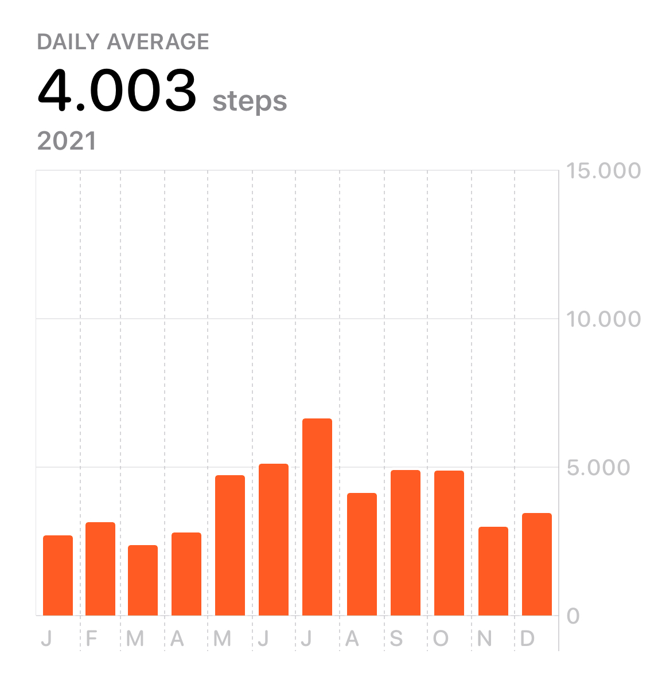
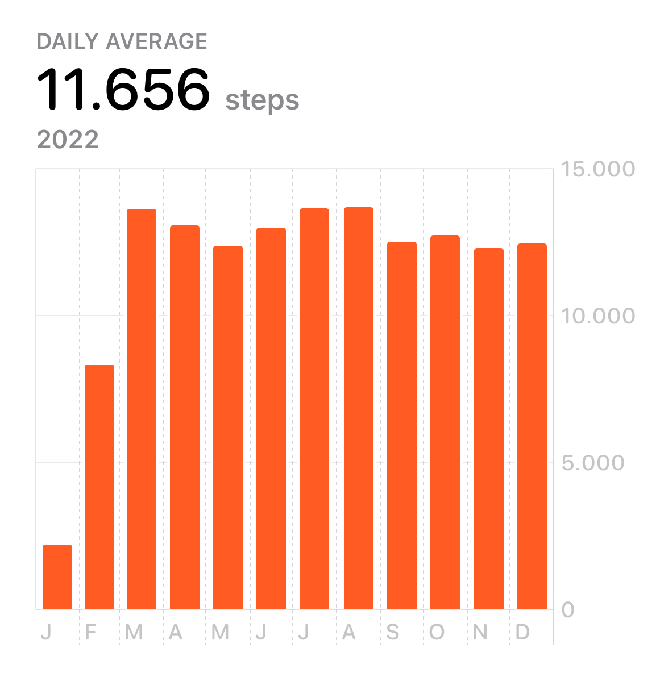

Earlier this year I decided that I’m not walking enough. It’s supposed to be healthy and my average daily step count for 2021 looked like this:

That’s obviously not good enough. An average of 4000 steps is not only embarrassing but also a far cry from the 10,000 steps you’re supposed to walk if you trust some company’s advertisements. Or [science](https://www.inc.com/jessica-stillman/health-exercise-fitness-walking-study.html).

I tried walking 10,000 steps a day previously and found that it’s basically impossible to do if you don’t have a commute or two hours a day to walk through the city. Since I’ve been working from home for six years now and I didn’t plan on walking through Berlin Mitte two hours each day, I needed a better solution.

My friend Luise told me about her WalkingPad. A slow treadmill you can put under your standing desk to walk while working. A worthwhile investment, as you can see by my stats for 2022.

If you want to walk more in 2023, make sure to check out [Stoins](https://stoins.com/). It’s a step counter I designed and programmed that lets you repair your walking streak by collecting Stoins. It’s a whole thing.
