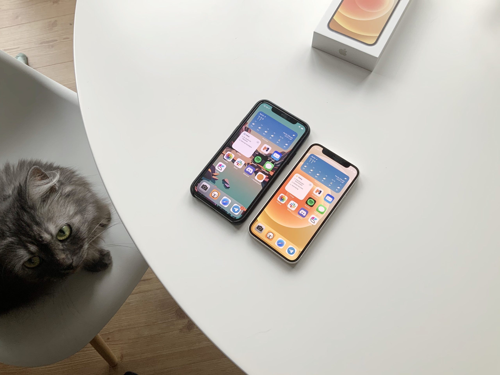

Manchmal, wenn man in einem Raum ist, in dem sich ein subtiles Geräusch im Hintergrund stetig aber unauffällig in die eigene Psyche bohrt, merkt man diese Belastung erst wenn sie von einem fällt. So geht es mir mit dem iPhone 12 Mini. Seit ich es in die Hand nahm, war ich absolut überzeugt, dass mir all meine iPhones seit dem iPhone X zu groß und schwer waren.

Hat mich mein sauteures iPhone 11 Pro wirklich belastet? Natürlich nicht. Ist das iPhone 12 Mini ein besseres Gerät für meine Ansprüche? Absolut. Es fühlt sich weniger substantiell an. Egaler, auf eine Art. Was es damit mehr zu einem Werkzeug als einem Schmuckstück macht und ein wenig seinen Glanz verliert. Das ist, für mich als jemanden der weiterhin viel Wert darauf legt nicht zu sehr in digitale Löcher abzudriften, ein großes Plus.

Dass ich es direkt weniger wertschätze und behüten möchte, zeigt sich auch darin, dass ich das erste Mal sehr Jahren mein Handy ohne Schutzhülle mit mir herumschleppe. Das ist seit dem iPhone 5 nicht mehr passiert und fühlt sich fantastisch an. Es ist einfach nur ein kleiner Screen, der mir Kommunikation mit Freunden und Zugriff auf alles Wissen der Welt ermöglicht, dabei aber nicht bei Nicht-Nutzung wie Ballast meine Hosentasche Richtung Erdboden zieht. Im Gegenteil! Ich spüre es in meiner Hosentasche kaum. Das erste Mal seit Jahren.

Sollte Apple in Zukunft entscheiden, dass kleine Telefone doch nichts sind, was sie produzieren wollen, wird das ein Problem für mich. Ich habe Blut geleckt.
