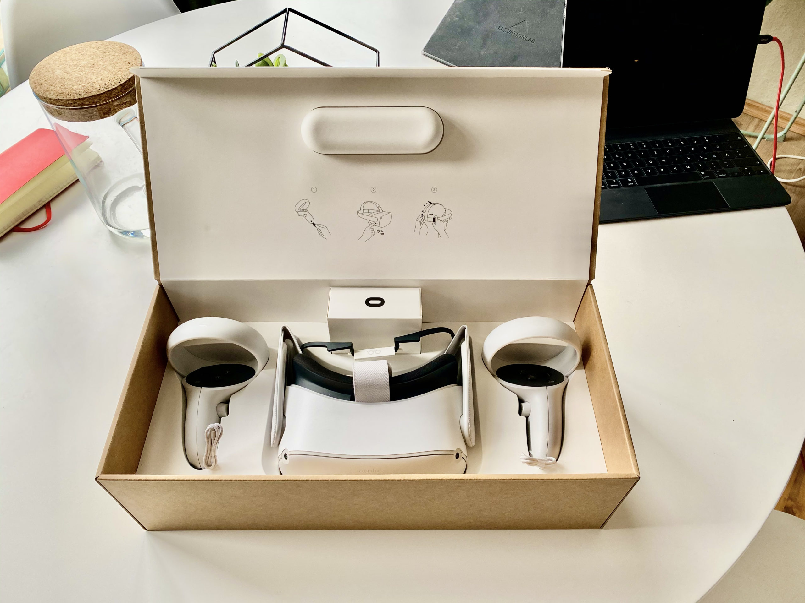

Vorweg: Ich verstehe das Problem. Weder bin ich ein großer Fan von Facebook, noch von übermäßigem Datensammeln. Ich verstehe auch die Grundregeln des Kapitalismus und weiß, dass ich mit meinem Geld implizit befürworte, was Facebook in anderen Bereichen macht.

Meine Begeisterung für Technologie aus der Zukunft, die aus irgendeinem Grund bereits in der Gegenwart zu haben ist, war aber an dieser Stelle stärker. Da hat mich nicht mal abgehalten, dass ich die Oculus Quest 2 in Frankreich bestellen musste, weil sie aus politischen Gründen in Deutschland nicht zu kaufen ist. Meine Form des Punkrocks. Tatsächlich habe ich sie sogar am erstmöglichen Tag vorbestellt, so sehr freute ich mich auf sie.

Es ist gar nicht so lange her, dass ich Half Life: Alyx einen Quantensprung der Unterhaltung nannte. Damals spielte ich es auf meiner ersten Generations Oculus Rift und hatte eine unglaubliche Erfahrung, an die ich noch immer gerne zurück denke. Klingt völlig pathetisch, ist aber so. Kürzlich wurde eine Version mit Developer Commentary veröffentlicht und ich werde es zeitnah noch mal durchspielen.

Der große Unterschied zu meiner Rift und der Quest 2? An der Rift hängt, durch Kabel verbunden, mein 2000 € Gaming-PC, der für den gesamten Software-Teil der Angelegenheit verantwortlich ist. An dem PC hängen außerdem noch zwei Beacons, die der Rift die Möglichkeit geben sich im Raum zu orientieren.

Die Quest 2 hingegen ist ein ganzer Computer, der sich durch Kameras selbst im Raum orientiert. Das Headset und die beiden Controller sind alles, was man braucht. Letztere sind theoretisch sogar optional, weil Hand Tracking ebenfalls existiert und überraschend gut funktioniert.
Von Real Reality zu Virtual Reality zu kommen, dauert wortwörtlich 5 Sekunden. Setzt man das Headset auf, geht es automatisch an und man befindet sich direkt im Virtual Reality Homescreen.

Klar, die Spiele, die direkt auf der Quest laufen, sind kein Half Life: Alyx. Kein Problem. Dafür kann ich die Quest weiterhin an meinen PC anschließen und dessen Rechenleistung nutzen. Tat ich bisher aber nicht, weil die auf der Quest verfügbaren Experiences mir genug Freude bereiteten. Ein Highlight der Pandemie und des aktuellen Lockdowns ware Walkabout Minigolf. Zwei Freunde von mir haben ebenfalls eine Quest 2 bestellt und wir haben so einige Abende in VR verbracht und virtuelle Bälle in virtuelle Golflöcher befördert. Das Voicechat Feature der Quest ist überraschend gut.

Sich in VR mit Freunden zu unterhalten, grob ihre Körpersprache erahnen zu können und nebenbei ein bisschen Minigolf spielen klingt vielleicht zuerst etwas albern, aber es ist eine sehr neue Erfahrung. Nach diesen Abenden hatte ich das Gefühl etwas mit Freunden gemacht zu haben. Wir standen an den gleichen Orten, wir schauten in die gleichen Landschaften und unterhielten uns dabei über dies und das. Klar, ich wäre auch lieber in einer Bar, aber was tut man nicht alles.

Nur 344 € kostet so ein Gerät. Klar. Das ist theoretisch viel Geld. Aber diese 344 € bringen jemandem, der generell an Technologie interessiert ist und bisher keinen Zugang zu VR hatte, nicht einfach nur ein neues Gerät, sondern eine völlig neue Welt der Unterhaltung. Das ist kein kleines Upgrade, wie von einem iPhone 8 auf ein iPhone 12 wechseln. Das ist eine völlig neue technologische Spähre, die, wie ich bereit bin immer wieder zu erwähnen, über VR zu AR unsere Welt in den nächsten Jahren völlig verändern wird. Mark my words.
