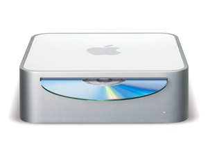

It's the Mac's 40th birthday, and people on [Mastodon](https://mastodon.social/tags/MyFirstMac) are sharing their very first Macs.

Mine was a [Mac Mini G4](<https://en.wikipedia.org/wiki/Mac_Mini#G4_polycarbonate_(2005)>). I didn't even realize that I actually had started using Macs before the Intel transition happened until I read the Wikipedia article about it just now. The hardware specifics didn't interest me back then. Fifteen-year-old me wanted to become a designer and knew that all the designers he looked up to used Macs, so there was really no choice.

My previous computer was a very old and very slow PC that didn't even run the games all my friends were playing together online. Let's not even talk about the performance of my pirated copy of Photoshop CS2.

Unboxing and placing the Mac Mini on top of my weird glass corner desk felt like receiving a ticket into a whole new world. I finally could do the things I saw designers do online. OS X felt like it was a gift from the gods. Everything was pretty, worked well, and instilled in me an appreciation for excellence that I hadn't felt before and that is still going strong.

Looking back, that Mac Mini G4 wasn't just a piece of tech; it was the starting point of my design journey. It turned my aspirations into real projects and set the standard for what I expect from technology. As the Mac celebrates its 40th, I realize it's not just about the machine but about the doors it opened for me. It's funny how a small box can play such a big part in your story.
